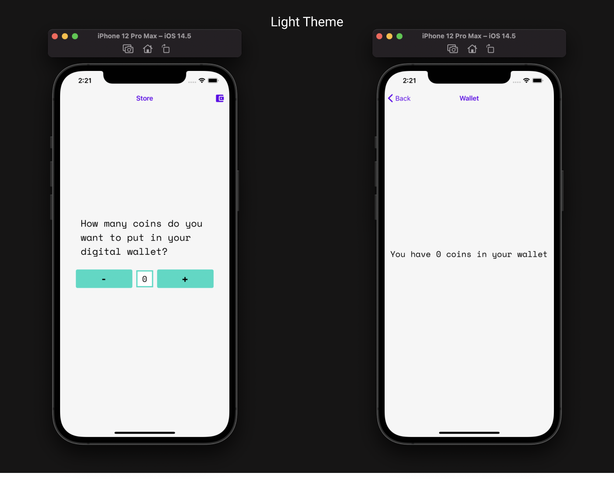

# React Native Expo Template

A simple Expo template with the following features:

- Prettier configured
- React Navigation v5
- Boosted navigator animation for an increased visual performance
- Intermediary project structure
- Small component library to get started with
- LightTheme and DarkTheme pre-configureds
- UseContext with UseReducer to manage global contexts
- Responsive fontsize


It's easy to create a project, strip out the few components included, and still have the architecture in place to quickly start building an app.

## Usage

> Be sure to have the [Expo CLI](https://docs.expo.io/workflow/expo-cli/) installed.

```bash
expo init --template @ctrl-mota/expo-template
```

- Run on iOS: `yarn ios` or `npm run ios`
- Run on Android: `yarn android` or `npm run android`
- Run expo clear on any plataform: `yarn clear` or `npm run clear`
- Check Code: `yarn check` or `npm run check`
- Format Code: `yarn format` or `npm run format`

## Themes

### Android


### IOS




